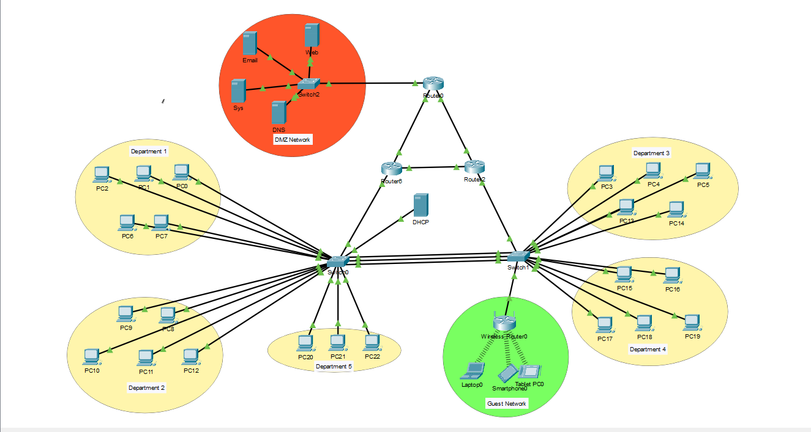

# Simulated-Enterprise-Network
This project is a simulated enterprise network built using Cisco Packet Tracer to practice networking and security concepts. It includes VLAN segmentation, router redundancy (HSRP), a secured DMZ, and a guest Wi-Fi network. The network is designed with security and redundancy in mind.

## 🛠 Technologies Used
- **VLANs** for departmental segmentation
- **Router-on-a-Stick** inter-VLAN routing
- **HSRP (Hot Standby Router Protocol)** for router failover
- **WPA2-PSK with AES** encryption for guest Wi-Fi
- **Syslog Server** for centralized logging
- **Access Control Lists (ACLs)** to restrict unauthorized access
- **Spanning Tree Protocol (STP)** for redundancy and preventing loop
- **Dynamic Host Configuration Protocol (DHCP)** for providing ip address automitically
- **Port Security**  for securing switche's ports
- **Etherchannel**  for increased bandwidth and redundancy
- **Email Server** to provide email service
- **Domain Name System (DNS)** to map ip to domain name
- **Secure Socket Layer (SSH)** for securing remote access

## 🔍 Network Topology
  

## 🚀 Features & Configuration
1. **Network Segmentation**
   - 6 VLANs (Departments 1-5 and Guest Network)  
   - 1 **DMZ** network  
   - 1 **Guest Wi-Fi network**  
   
2. **Security Mechanisms**
   - **Syslog server** logs all network device activities  
   - **WPA2 wireless security** for guest access
   - **Port Security**  for securing switche's ports
   - **Secure Socket Layer (SSH)** for securing remote access
   - **Access Control List (ACL)** to limit access between departments

3. **High Availability & Redundancy**
   - **HSRP failover** between core routers  
   - **STP prevents switching loops**
   - 
## 📄 Detailed Documents about the Project

1. **Network Design** [Click Here](./docs/design.md)
2. **IP Addressing** [Click Here](./docs/IP_Addressing.md)
3. **VLAN Implementation** [Click Here](./docs/vlan_implementation.md)
4. **ACL Implementation** [Click Here](./docs/ACL_Implementation.md)

## 🔧 How to Open the Project
1. Download [Cisco Packet Tracer](https://www.netacad.com/courses/packet-tracer).
2. Clone this repository or download the `.pkt` file.
3. Open the `.pkt` file in Cisco Packet Tracer.

## 📖 Learning Outcomes
- Practical understanding of **Networking**.
- Hands-on experience with **VLANs, routing, and ACLs and SSH Configuration**.

## 👤 About Me

Created by [Yell Mahn Oo] — aspiring Cybersecurity Analyst  
[LinkedIn Profile](https://www.linkedin.com/in/yell-mahn-44032a346/)

---

Feel free to suggest improvements! 🚀
